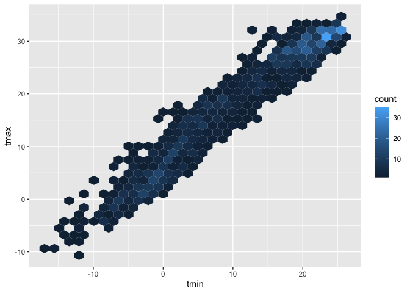
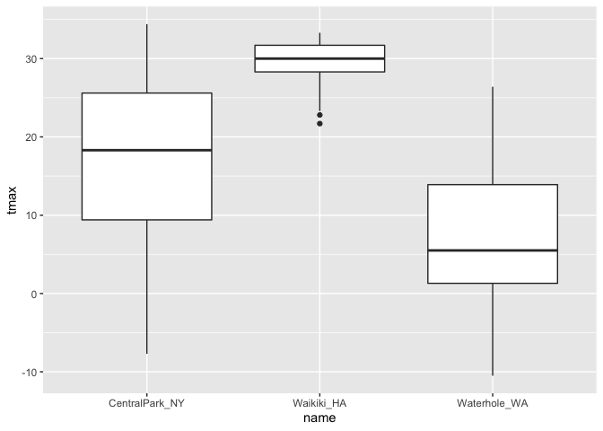
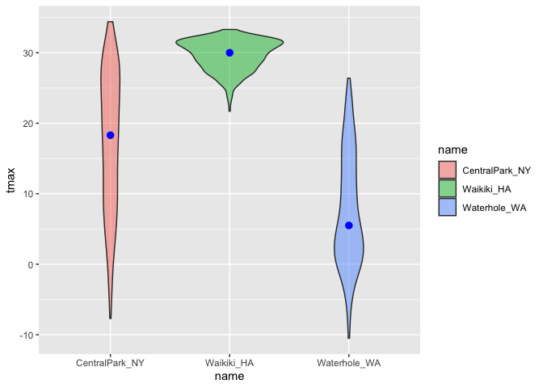

20220929: Visualization with ggplot2
================
wyy
2022-09-29

We’ll be working with NOAA weather data, which is downloaded using
rnoaa::meteo_pull_monitors function in the code chunk below; similar
code underlies the weather dataset used elsewhere in the course. Because
this process can take some time, I’ll cache the code chunk.

``` r
library(tidyverse)
```

    ## ── Attaching packages ─────────────────────────────────────── tidyverse 1.3.2 ──
    ## ✔ ggplot2 3.3.6      ✔ purrr   0.3.4 
    ## ✔ tibble  3.1.8      ✔ dplyr   1.0.10
    ## ✔ tidyr   1.2.1      ✔ stringr 1.4.1 
    ## ✔ readr   2.1.2      ✔ forcats 0.5.2 
    ## ── Conflicts ────────────────────────────────────────── tidyverse_conflicts() ──
    ## ✖ dplyr::filter() masks stats::filter()
    ## ✖ dplyr::lag()    masks stats::lag()

``` r
library(ggridges)
weather_df = 
  rnoaa::meteo_pull_monitors(
    c("USW00094728", "USC00519397", "USS0023B17S"),
    var = c("PRCP", "TMIN", "TMAX"), 
    date_min = "2017-01-01",
    date_max = "2017-12-31") %>%
  mutate(
    name = recode(
      id, 
      USW00094728 = "CentralPark_NY", 
      USC00519397 = "Waikiki_HA",
      USS0023B17S = "Waterhole_WA"),
    tmin = tmin / 10,
    tmax = tmax / 10) %>%
  select(name, id, everything())
```

    ## Registered S3 method overwritten by 'hoardr':
    ##   method           from
    ##   print.cache_info httr
    ## using cached file: ~/Library/Caches/R/noaa_ghcnd/USW00094728.dly
    ## date created (size, mb): 2022-09-29 10:15:34 (8.401)
    ## file min/max dates: 1869-01-01 / 2022-09-30
    ## using cached file: ~/Library/Caches/R/noaa_ghcnd/USC00519397.dly
    ## date created (size, mb): 2022-09-29 10:15:37 (1.699)
    ## file min/max dates: 1965-01-01 / 2020-03-31
    ## using cached file: ~/Library/Caches/R/noaa_ghcnd/USS0023B17S.dly
    ## date created (size, mb): 2022-09-29 10:15:38 (0.95)
    ## file min/max dates: 1999-09-01 / 2022-09-30

Let’s make a scatterplot

``` r
ggplot(weather_df,aes(x=tmin,y=tmax))+
  geom_point()
```

    ## Warning: Removed 15 rows containing missing values (geom_point).

<!-- -->

Let’s make the same scatterplot, but different

``` r
weather_df%>%
  drop_na()%>%
  #filter(name=="(entralPark_NY")%>%
  ggplot(aes(x=tmin,y=tmax))+
  geom_point()
```

<!-- -->

Let’s keep making the same plot but different.

``` r
plot_weather = 
  weather_df %>%
  ggplot(aes(x = tmin, y = tmax)) 

plot_weather + geom_point()
```

    ## Warning: Removed 15 rows containing missing values (geom_point).

<!-- -->
\## Advanced scatterplot The basic scatterplot gave some useful
information – the variables are related roughly as we’d expect, and
there aren’t any obvious outliers to investigate before moving on. We
do, however, have other variables to learn about using additional
aesthetic mappings.

Let’s start with name, which I can incorporate using the color
aesthetic:

``` r
ggplot(weather_df, aes(x = tmin, y = tmax)) + 
  geom_point(aes(color = name))
```

    ## Warning: Removed 15 rows containing missing values (geom_point).

<!-- -->

color on the geom_point -\> one line for everything

``` r
ggplot(weather_df, aes(x = tmin, y = tmax)) + 
  geom_point(aes(color = name), alpha = .5) +
  # alpha: transparent
  geom_smooth(se = FALSE)
```

    ## `geom_smooth()` using method = 'gam' and formula 'y ~ s(x, bs = "cs")'

    ## Warning: Removed 15 rows containing non-finite values (stat_smooth).

    ## Warning: Removed 15 rows containing missing values (geom_point).

<!-- -->
color on the first line -\> 3 lines for all names

``` r
ggplot(weather_df, aes(x = tmin, y = tmax,color=name)) + 
  geom_point(alpha=.3) +
  geom_smooth(se = FALSE)
```

    ## `geom_smooth()` using method = 'loess' and formula 'y ~ x'

    ## Warning: Removed 15 rows containing non-finite values (stat_smooth).

    ## Warning: Removed 15 rows containing missing values (geom_point).

<!-- -->

maybe make separate panels.

``` r
ggplot(weather_df, aes(x = tmin, y = tmax, color = name)) + 
  geom_point(alpha = .5) +
  geom_smooth(se = FALSE) + 
  facet_grid(. ~ name)# column to be names
```

    ## `geom_smooth()` using method = 'loess' and formula 'y ~ x'

    ## Warning: Removed 15 rows containing non-finite values (stat_smooth).

    ## Warning: Removed 15 rows containing missing values (geom_point).

<!-- -->

``` r
ggplot(weather_df, aes(x = tmin, y = tmax, color = name)) + 
  geom_point(alpha = .5) +
  geom_smooth(se = FALSE) + 
  facet_grid( name~ .)# row to be names
```

    ## `geom_smooth()` using method = 'loess' and formula 'y ~ x'

    ## Warning: Removed 15 rows containing non-finite values (stat_smooth).

    ## Warning: Removed 15 rows containing missing values (geom_point).

<!-- -->

‘tmax’ vs ‘tmin’ is boring, let’s spice it up some.

``` r
ggplot(weather_df, aes(x = date, y = tmax, color = name)) + 
  geom_point(aes(size = prcp), alpha = .5) +
  geom_smooth(se=FALSE) + 
  facet_grid(. ~ name)+
  theme(axis.text.x=element_text(angle=90,vjust=0.5,hjust=1))
```

    ## `geom_smooth()` using method = 'loess' and formula 'y ~ x'

    ## Warning: Removed 3 rows containing non-finite values (stat_smooth).

    ## Warning: Removed 3 rows containing missing values (geom_point).

<!-- -->

``` r
#theme: 横坐标label竖过来放
```

## Same quick stuff

``` r
weather_df%>%
  ggplot(aes(x=tmin,y=tmax))+
  geom_hex()
```

    ## Warning: Removed 15 rows containing non-finite values (stat_binhex).

<!-- -->
\## Univariate plots

Histograms, barplots,boxplots, violins

``` r
weather_df%>%
  ggplot(aes(x=tmax,color=name))+
  geom_histogram()
```

    ## `stat_bin()` using `bins = 30`. Pick better value with `binwidth`.

    ## Warning: Removed 3 rows containing non-finite values (stat_bin).

<!-- -->

``` r
weather_df%>%
  ggplot(aes(x=tmax,color=name))+
  geom_histogram()+
  facet_grid(.~name)
```

    ## `stat_bin()` using `bins = 30`. Pick better value with `binwidth`.

    ## Warning: Removed 3 rows containing non-finite values (stat_bin).

<!-- -->

``` r
ggplot(weather_df, aes(x = tmax, fill = name)) + 
  geom_histogram(position = "dodge", binwidth = 2)
```

    ## Warning: Removed 3 rows containing non-finite values (stat_bin).

<!-- -->

``` r
ggplot(weather_df, aes(x = tmax, fill = name)) + 
  geom_density(alpha = .4, adjust = .5, color = "blue")
```

    ## Warning: Removed 3 rows containing non-finite values (stat_density).

<!-- -->

# Boxplots

``` r
ggplot(weather_df, aes(x = name, y = tmax)) + geom_boxplot()
```

    ## Warning: Removed 3 rows containing non-finite values (stat_boxplot).

<!-- -->

# violin

``` r
ggplot(weather_df, aes(x = name, y = tmax)) + 
  geom_violin(aes(fill = name), alpha = .5) + 
  stat_summary(fun = "median", color = "blue")
```

    ## Warning: Removed 3 rows containing non-finite values (stat_ydensity).

    ## Warning: Removed 3 rows containing non-finite values (stat_summary).

    ## Warning: Removed 3 rows containing missing values (geom_segment).

<!-- -->

## sabing an embedding plots

``` r
weather_scatterplot=
  weather_df%>%
  ggplot(aes(x=date,y=tmax,color=name))+
  geom_point(aes(size=prcp),alpha=.3)+
  geom_smooth(se=FALSE)+
  facet_grid(.~name)

weather_scatterplot
```

    ## `geom_smooth()` using method = 'loess' and formula 'y ~ x'

    ## Warning: Removed 3 rows containing non-finite values (stat_smooth).

    ## Warning: Removed 3 rows containing missing values (geom_point).

<!-- -->

``` r
ggsave("results/weather_scatterplot.pdf",weather_scatterplot,width=8,height=5)
```

    ## `geom_smooth()` using method = 'loess' and formula 'y ~ x'

    ## Warning: Removed 3 rows containing non-finite values (stat_smooth).
    ## Removed 3 rows containing missing values (geom_point).

调图片宽度

``` r
weather_scatterplot
```

    ## `geom_smooth()` using method = 'loess' and formula 'y ~ x'

    ## Warning: Removed 3 rows containing non-finite values (stat_smooth).

    ## Warning: Removed 3 rows containing missing values (geom_point).

<!-- -->
